Result: 
With humanoid base
https://github.com/BoQsc/godot-demo-projects/tree/quaternius-ragdoll-walkthrough/3d/ragdoll_physics/characters_quaternius

With Human base and Idle animation pose enabled. (Humanoid base as donor of PhysicalSkeleton)
https://github.com/BoQsc/godot-demo-projects/tree/quanternius-ragdoll-walkthrough-human-base/3d/ragdoll_physics/characters_quaternius

### Preparation
Asset (CC0):
https://quaternius.itch.io/universal-animation-library  
Testing Playground and Godot Ragdoll Reference:

https://github.com/godotengine/godot-demo-projects/tree/master/3d/ragdoll_physics   
### Start 
1. Let's start by opening the `godot-demo-projects\3d\ragdoll_physics\` project.2. 
3. Create folder `characters_quaternius` in the project folder.
   * Copy the `AnimationLibrary_Godot_Standard.glb` into this folder.
   * Create a new Node 3D Scene `quaternius_ragdoll.tscn` and drag this `.glb` file into the scene. 
3. Let's retarget the model's skeleton to create a GeneralSkeleton. 
This will allow for easier transfer of PhysicalSkeleton later on.

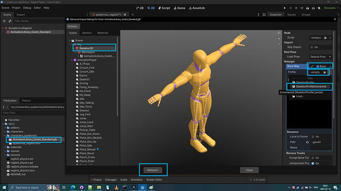

4. Let's mark the model as Editable Children

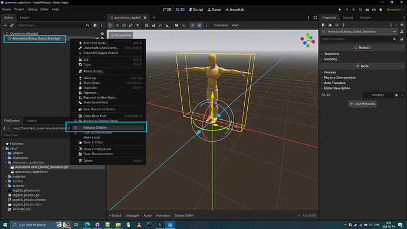

5. Let's create a Physical Skeleton.

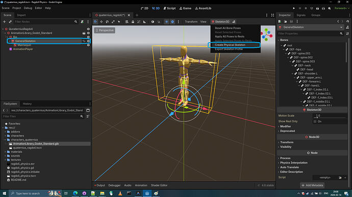

6. Let's inspect the newly created **PhysicalBoneSimulator3D** by entering **display overdraw**.

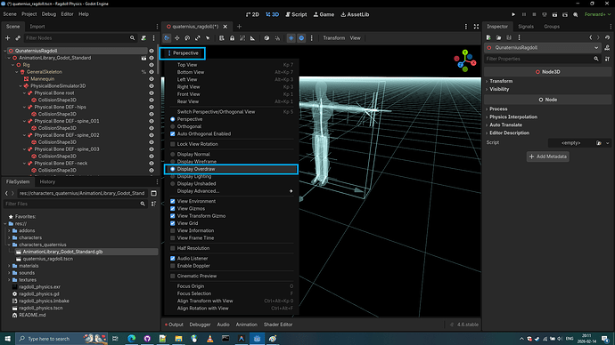

7. Let's inspect the first Physical bone of the PhysicalBoneSimulator3D: `Physical Bone root`.
  This is clearly some kind of helper bone, so we are immediately deleting it. (it's obstructing the physical bones of legs)

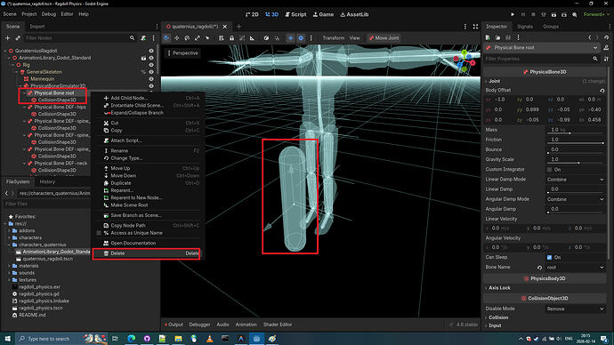

8. Now that we have no more weird bones, let's continue by enlarging the physical bones by clicking on CollisionShape3D and uniformly scaling them using **scaling handles**.

**Tip:** I generally have personal belief that **rotation and positioning** should be done on the **entire PhysicalBone** and **scaling** should be done by scaling the **CollisionShape3D of the Physical Bone**.

It took me around 11 minutes to complete scaling and rotating the bones and I still believe it's far from perfect due to my limited knowledge as of now.

Full Video: https://github.com/BoQsc/quaternius-ragdoll-walkthrough/releases/download/0/2026-02-14.21-20-11.-.Copy.mp4

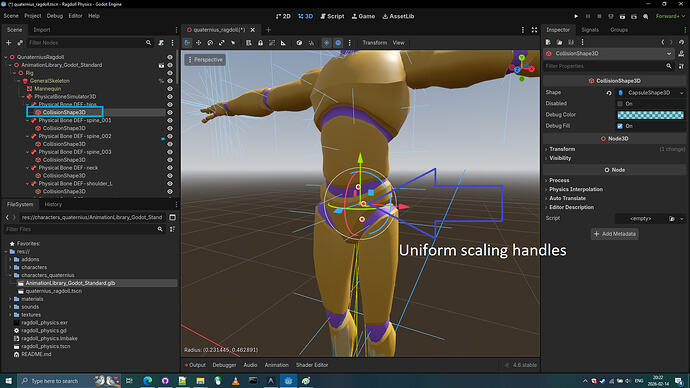

9. Now that we have bones matching or outmatching the mesh of the model, let's point out the obvious now: where is the head bone? I don't know. We will figure it out along the way if anything can be done about it. in the worst case scenario we would just  scale up the neck physical bone to accomodate for the head. However I maybe already figured out how to bring up head physical bone.

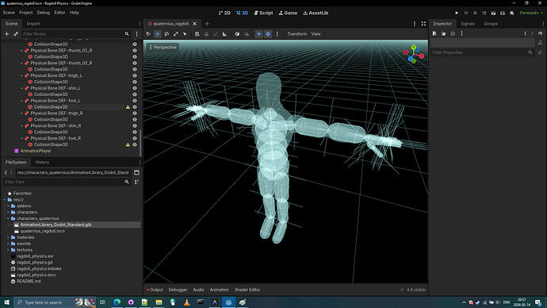

### Creating Missing Head Physical Bone
We simply duplicate the neck physical bone and select Bone name Head then adjust the head physical bone location and size the CollisionShape3D so it fits the mesh of the head.

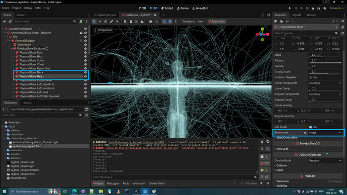

Remember to make the CollisionShape3D of the Head a Unique element:

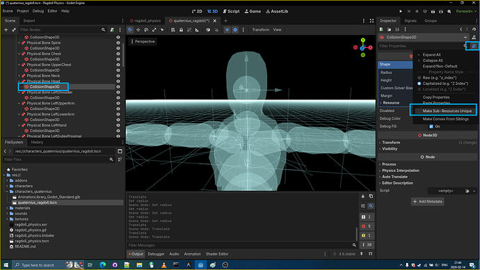

And so after some scaling adjustments to the CollisionShape3D and transform adjustments of PhysicalBone itself we have a head PhysicalBone.

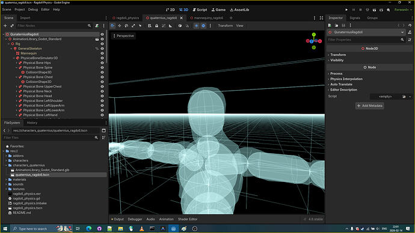

10. Let's collapse the PhysicalBoneSimulator  node so we can easily select subnodes

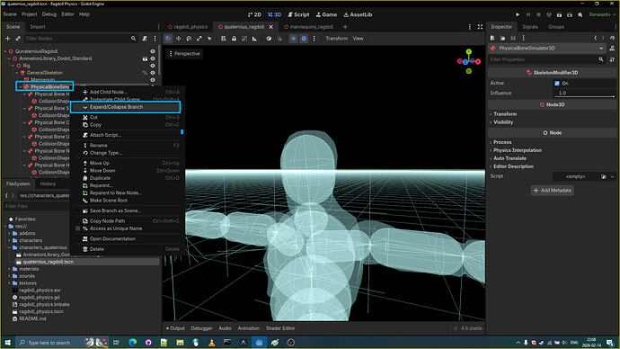

11. Let's now change all bones joint types to cone join type.

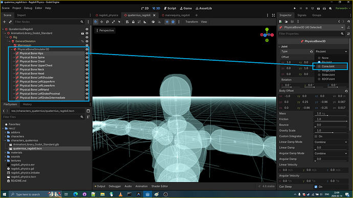

12. Let's apply the joint constraints to all the joints.
     * joint_constraints/swing_span: 20.0
     * joint_constraints/twist_span: 20.0

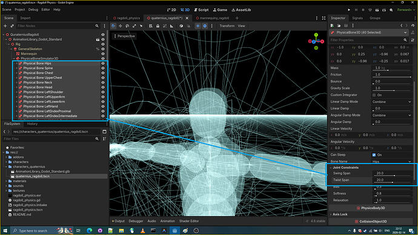

13. Let's apply friction and bounciness to all the bones.

     * friction: 0.8
     * bouncines: 0.6

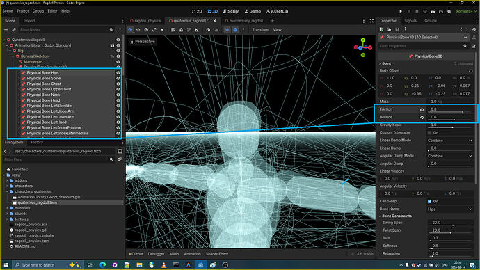

14. Now that we have all this setup we can go on and introduce this ragdoll into the demo.
15. Let's copy the `mannequiny_ragdoll.gd` script into our folder `characters_quaternius`

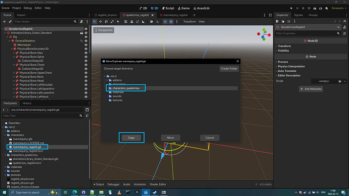

16.  Let's edit our  `mannequiny_ragdoll.gd` by replacing/changing nodes paths in the script.

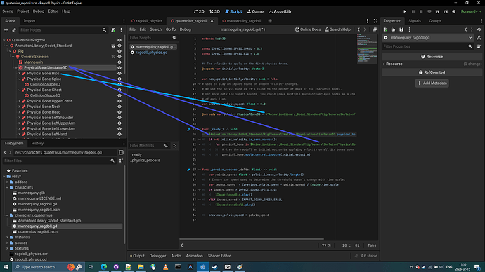

17. Let's attach our `mannequiny_ragdoll.gd` to our top level Node 3D

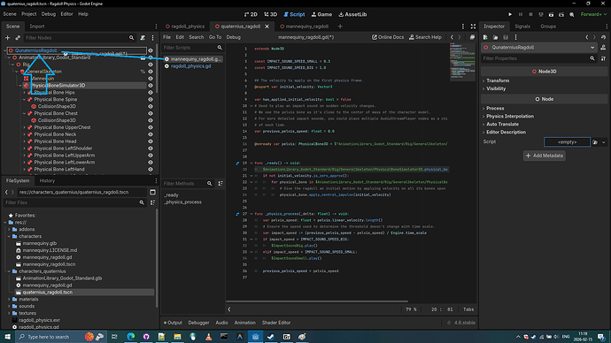

18. Let's copy the `AudioStreamPlayers` from the `mannequiny_ragdoll.tscn` 

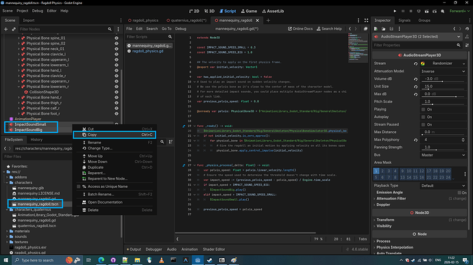
19. Paste the `AudioStreamPlayers` to our QunaterniusRagdoll scene.

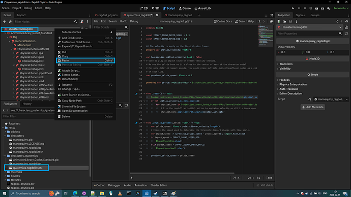

20. Let's edit the `ragdoll_physics.gd` so that pressing spacebar would spawn our ragdoll.

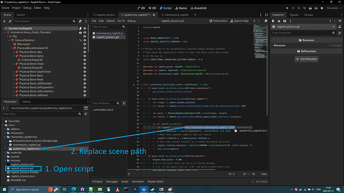

21. Let's run the `ragdoll_physics.tscn` scene. 
  As we can see our ragdoll might not be perfect, 
looking for your suggestions on how to make it more perfect.

### Transfer PhysicalSkeleton/Ragdoll to Quaternius Human Base
To transfer the PhysicalSkeleton you have to **duplicate it and then move it**, instead of just moving or copying it.

1. First, let's download [Quaternius Universal Base Characters](https://quaternius.com/packs/universalbasecharacters.html)
2. Let's do Skeleton3D retargeting and do reimport of our **Superhero_Male_FullBody.gltf**

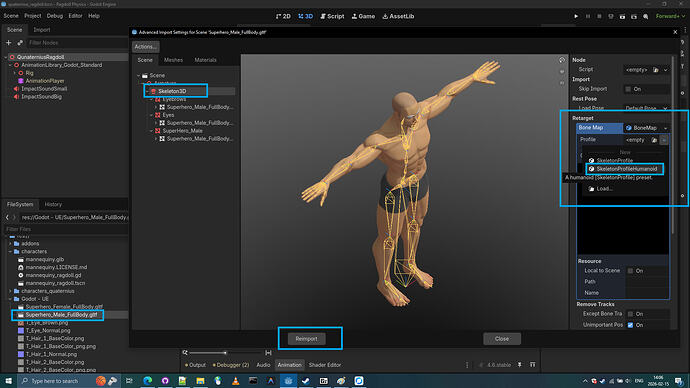

3. Let's add **Superhero_Male_FullBody.gltf** into the scene.

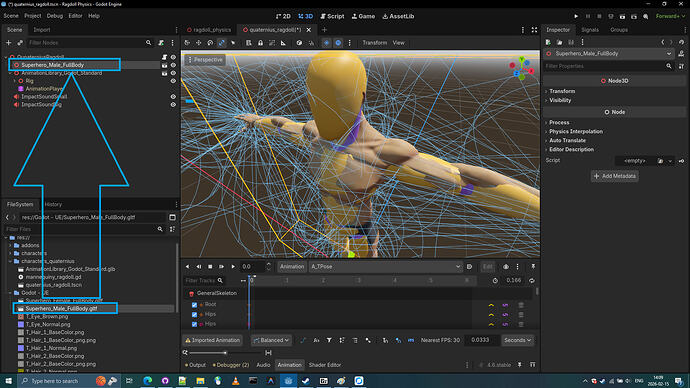

4. Let's mark it as Editable Children

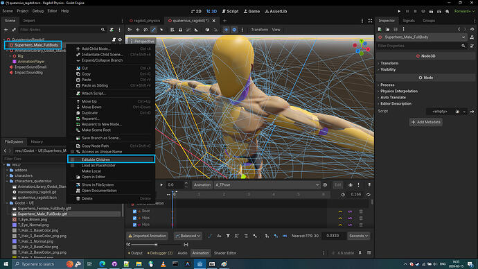

5. Let's duplicate the PhysicalBoneSimulator3D

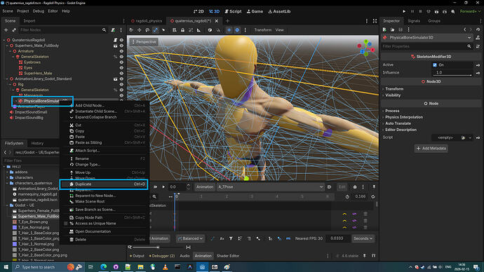

6. Let's move the duplicated `PhysicalBoneSimulator3D2` to the human base.

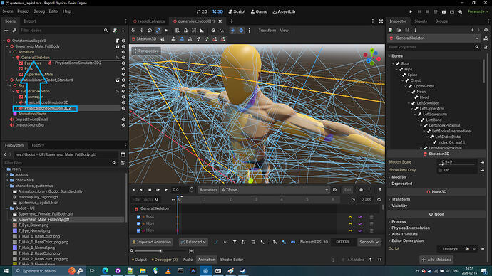

7. Let's rename `PhysicalBoneSimulator3D2` to `PhysicalBoneSimulator3D`

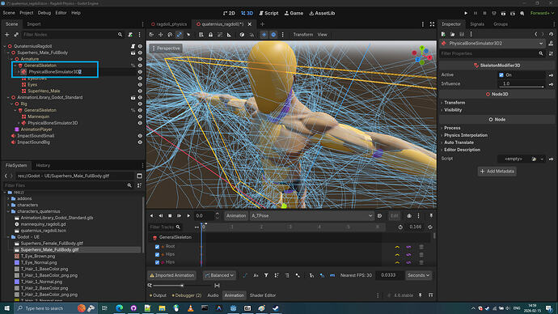

8. Done. We successfully transfered the PhysicalSkeleton to the Human base.
9. Let's delete the donor humanoid  base (`AnimationLibrary_Godot_Standard`)

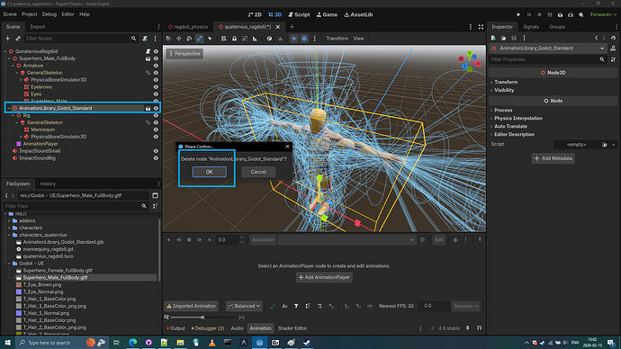

10. Let's reintroduce the Human Base into Godot playground.

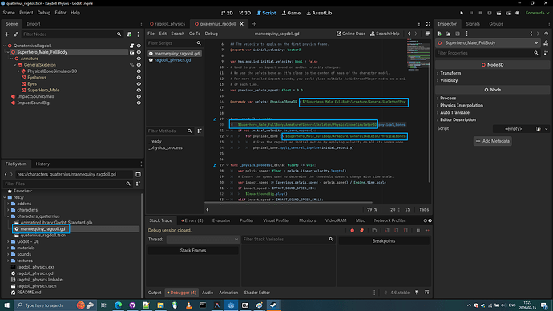

11. Let's see what we have.

12. Let's apply idle pose from previous animation library. 
13. First let's mark and reimport `AnimationLibrary_Godot_Standard.glb` as animation library.

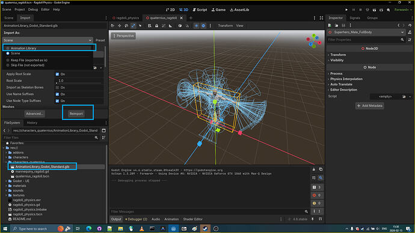

14.  Retarget Skeleton3D of Animation Library 
   ( We already retargeted animation library skeleton)
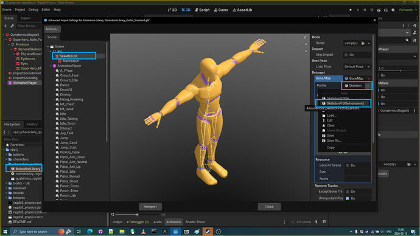

14. Add new animation player to the human base.
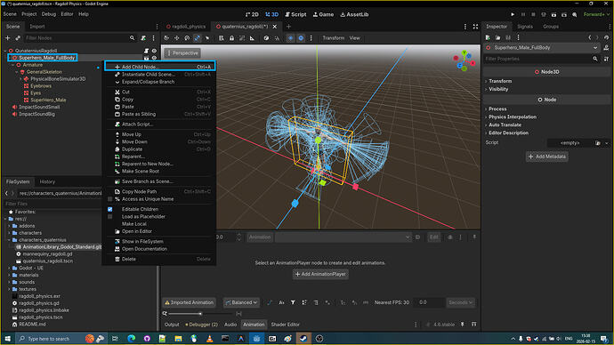

15. Load up animation library.

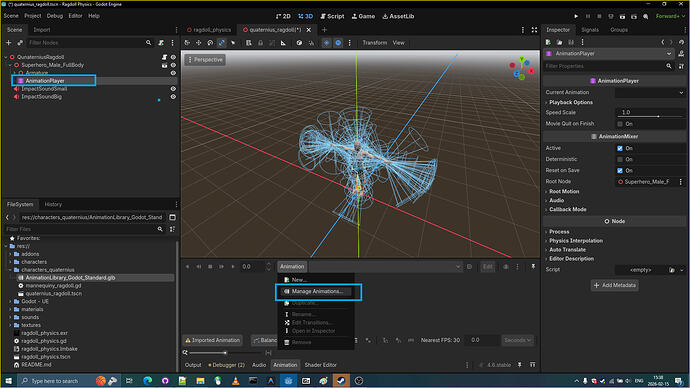
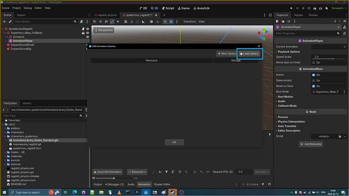

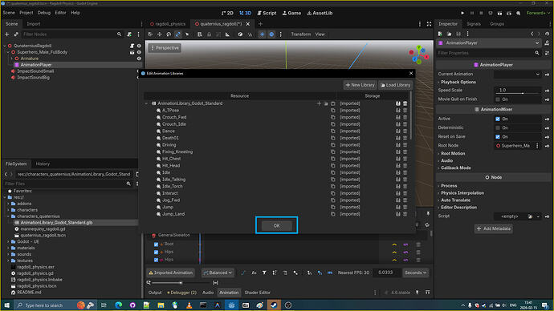

16 Select the Idle animation and start the  `ragdoll_physics.tscn` ragdolls scene.

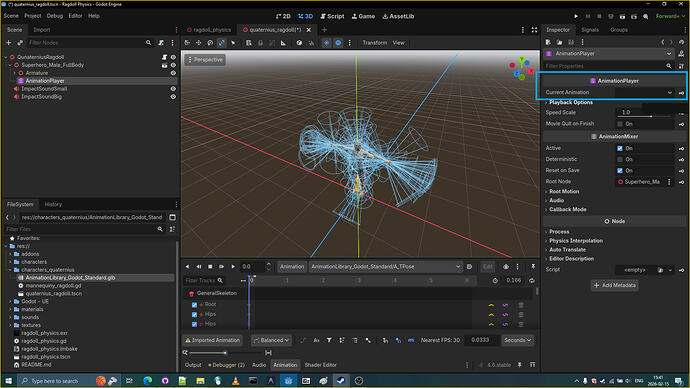

